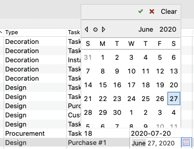

# Nebula CDateTime Widget 1.4.0.1
## [ Glimmer Custom Widget](https://github.com/AndyObtiva/glimmer#custom-widget-gem)
[](http://badge.fury.io/rb/glimmer-cw-cdatetime-nebula)

[](https://www.eclipse.org/nebula/widgets/cdatetime/cdatetime.php)

The [Nebula CDateTime Widget](https://www.eclipse.org/nebula/widgets/cdatetime/cdatetime.php) is a Date and Time selection widget that can be used in a textual, graphical, or combo mode.

Packaged as a [Glimmer Custom Widget](https://github.com/AndyObtiva/glimmer#custom-widget-gem) to provide date/time selection via a combo/dropdown-style widget in [Glimmer](https://github.com/AndyObtiva/glimmer) using the `c_date_time` [Glimmer DSL](https://github.com/AndyObtiva/glimmer#glimmer-dsl-syntax) keyword.

[glimmer-cw-cdatetime-nebula](https://rubygems.org/gems/glimmer-cw-cdatetime-nebula) 1.4.0.x gem versions map to Nebula CDateTime Widget version 1.4.0

## Java Imports

[glimmer-cw-cdatetime-nebula](https://rubygems.org/gems/glimmer-cw-cdatetime-nebula) includes and imports the following Java JAR libraries:
- 'vendor/nebula/org.eclipse.nebula.cwt_1.1.0.jar'
- 'vendor/nebula/org.eclipse.nebula.widgets.cdatetime_1.4.0.jar'

It also configures them in [Glimmer](https://github.com/AndyObtiva/glimmer) for auto import via JRuby `include_package` on first use.

## Pre-requisites

- [Glimmer](https://github.com/AndyObtiva/glimmer) application, [Glimmer](https://github.com/AndyObtiva/glimmer) custom shell, or another [Glimmer](https://github.com/AndyObtiva/glimmer) custom widget
- JRuby version required by Glimmer
- Java version required by Glimmer

## Setup

### Glimmer Application

Add the following to a [Glimmer](https://github.com/AndyObtiva/glimmer) application `Gemfile`:

```ruby
gem 'glimmer-cw-cdatetime-nebula', '1.4.0.1'
```

Run:

```
jruby -S bundle
```

(or just `bundle` if using RVM)

### Glimmer Custom Shell or Glimmer Custom Widget

When reusing in a [Glimmer](https://github.com/AndyObtiva/glimmer) custom shell or custom widget, you can follow the same steps for Glimmer application, and then add a require statement to your library file after `glimmer` and before additional library require statements:

```ruby
require 'glimmer'
require 'glimmer-cw-cdatetime-nebula'
# ... more require statements follow
```

## Instructions

`c_date_time` is the [Glimmer DSL](https://github.com/AndyObtiva/glimmer#glimmer-dsl-syntax) keyword to use.

Further instructions may be found at the [Nebula CDateTime Widget homepage](https://www.eclipse.org/nebula/widgets/cdatetime/cdatetime.php):

[https://www.eclipse.org/nebula/widgets/cdatetime/cdatetime.php](https://www.eclipse.org/nebula/widgets/cdatetime/cdatetime.php)

## API

Here is the Nebula CDateTime Widget [Javadoc API page](https://www.eclipse.org/nebula/releases/latest/javadoc/org/eclipse/nebula/widgets/cdatetime/CDateTime.html):

[https://www.eclipse.org/nebula/releases/latest/javadoc/org/eclipse/nebula/widgets/cdatetime/CDateTime.html](https://www.eclipse.org/nebula/releases/latest/javadoc/org/eclipse/nebula/widgets/cdatetime/CDateTime.html)

## Examples:

### Example of using `c_date_time` widget:

```ruby
# ... 
  composite {
    # ...
    @start_at = c_date_time(CDT::BORDER | CDT::COMPACT | CDT::DROP_DOWN | CDT::DATE_LONG) {
      # ...
      selection bind(@task, :start_at)
      on_key_pressed { |event|
        @end_at.swt_widget.set_focus if event.keyCode == swt(:cr)
      }
    }
  }
# ...
```


### Example of using `c_date_time` as a `table` / `table_column` editor:

```ruby
# ...
  table { |table_proxy|
    # ... other table_column declarations
    table_column {
      text 'Start Date'
      width CONFIG[:table_column_width_hint]
      editor :c_date_time, CDT::BORDER | CDT::COMPACT | CDT::DROP_DOWN | CDT::DATE_LONG, property: :start_at
    }
    table_column {
      text 'End Date'
      width CONFIG[:table_column_width_hint]
      editor :c_date_time, CDT::BORDER | CDT::COMPACT | CDT::DROP_DOWN | CDT::DATE_LONG, property: :end_at
    }
    # ... other table_column declarations
    items bind(Task, :list), column_properties(:project_name, :task_type, :name, :start_date, :end_date, :duration, :priority)
    # ... other table GUI code
  }
# ...
```



## Change Log

- 1.4.0.1: Prevent table editor from saving upon traversing months in drop down Calendar
- 1.4.0.0: Initial version

## Contributing to glimmer-cw-cdatetime-nebula
 
- Check out the latest master to make sure the feature hasn't been implemented or the bug hasn't been fixed yet.
- Check out the issue tracker to make sure someone already hasn't requested it and/or contributed it.
- Fork the project.
- Start a feature/bugfix branch.
- Commit and push until you are happy with your contribution.
- Make sure to add tests for it. This is important so I don't break it in a future version unintentionally.
- Please try not to mess with the Rakefile, version, or history. If you want to have your own version, or is otherwise necessary, that is fine, but please isolate to its own commit so I can cherry-pick around it.

## Copyright

[MIT](LICENSE.txt)

Copyright (c) 2020 - Andy Maleh

--

[](https://github.com/AndyObtiva/glimmer) Built for [Glimmer](https://github.com/AndyObtiva/glimmer) (Ruby Desktop Development GUI Library).
