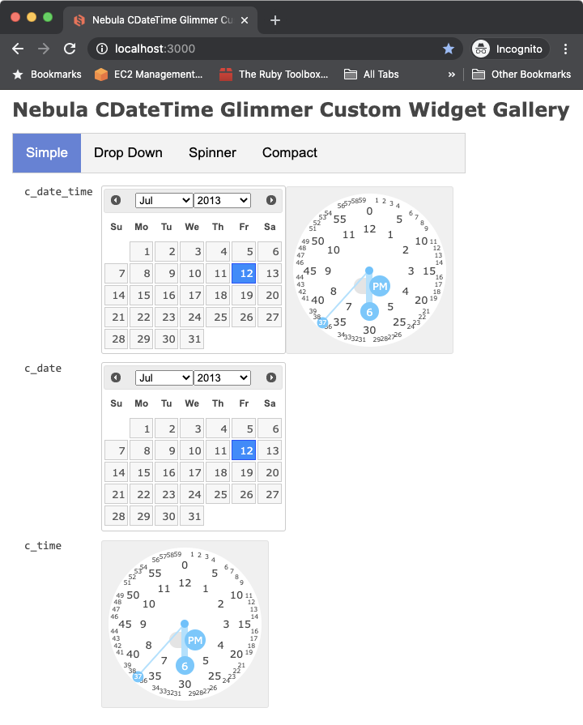
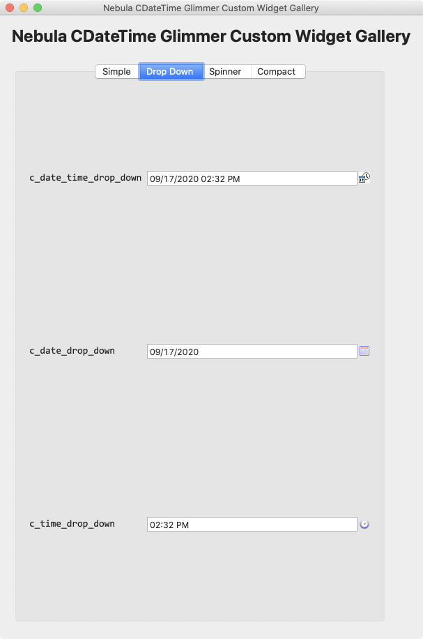
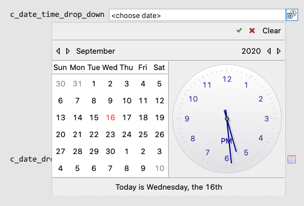
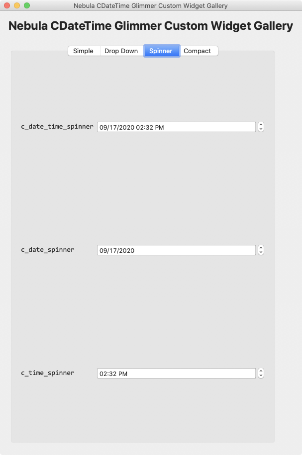
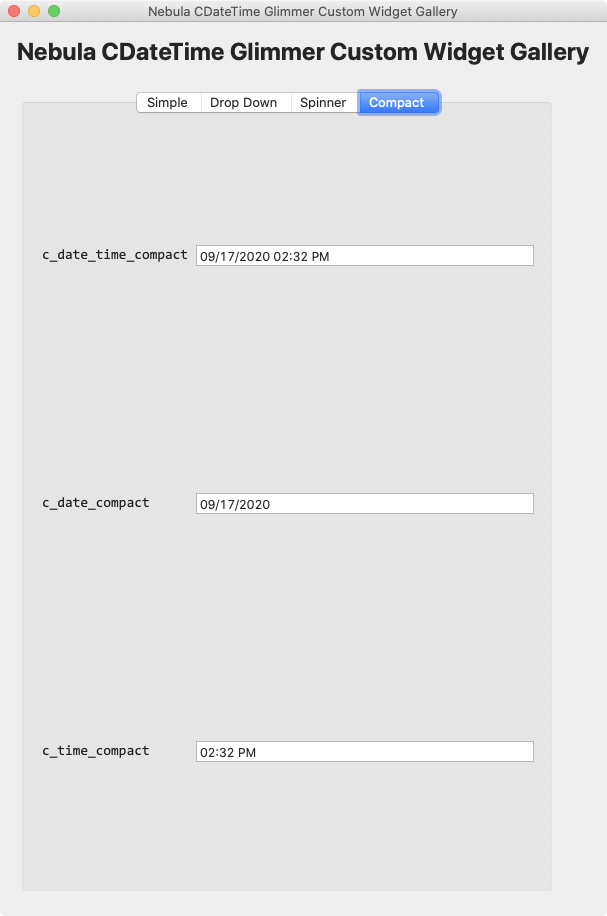

# Nebula CDateTime Widget 1.5.0.3.0
## [ Glimmer Custom Widget](https://github.com/AndyObtiva/glimmer-dsl-swt#custom-widget-gem)
[](http://badge.fury.io/rb/glimmer-cw-cdatetime-nebula)

[](https://www.eclipse.org/nebula/widgets/cdatetime/cdatetime.php)

The [Nebula CDateTime Widget](https://www.eclipse.org/nebula/widgets/cdatetime/cdatetime.php) is a Date and Time selection widget that can be used in a simple, dropdown, spinner, or compact style.

Packaged as a [Glimmer Custom Widget](https://github.com/AndyObtiva/glimmer-dsl-swt#custom-widget-gem) to provide date/time selection via a combo/dropdown-style widget in [Glimmer DSL for SWT](https://github.com/AndyObtiva/glimmer-dsl-swt) using the `c_date_time` [Glimmer DSL](https://github.com/AndyObtiva/glimmer-dsl-swt#glimmer-gui-dsl-syntax) keyword.

Now, also supports [Glimmer DSL for Opal](#glimmer-dsl-for-opal) Auto-Webifier of Desktop Apps via Rails/Opal.

[glimmer-cw-cdatetime-nebula](https://rubygems.org/gems/glimmer-cw-cdatetime-nebula) 1.5.0.x.y gem versions map to Nebula CDateTime Widget version 1.5.0 (which comes with [Nebula 2.4.2](https://www.eclipse.org/nebula/releases/2.4.2/index.php))

## Table of contents

- [Nebula CDateTime Widget 1.5.0.3.0](#nebula-cdatetime-widget-15030)
  - [Pre-requisites](#pre-requisites)
  - [Setup](#setup)
    - [Glimmer DSL for SWT](#glimmer-dsl-for-swt)
      - [Glimmer Application](#glimmer-application)
      - [Glimmer Custom Shell or Glimmer Custom Widget](#glimmer-custom-shell-or-glimmer-custom-widget)
      - [Java Imports](#java-imports)
    - [Glimmer DSL for Opal](#glimmer-dsl-for-opal)
      - [Setup](#setup)
  - [Instructions](#instructions)
    - [Sample](#sample)
      - [Glimmer DSL for SWT Sample](#glimmer-dsl-for-swt-sample)
      - [Glimmer DSL for Opal Sample](#glimmer-dsl-for-opal-sample)
    - [Simple Style](#simple-style)
      - [`c_date_time`](#cdatetime)
      - [`c_date`](#cdate)
      - [`c_time`](#ctime)
    - [Drop Down Style](#drop-down-style)
      - [`c_date_time_drop_down`](#cdatetimedropdown)
      - [`c_date_drop_down`](#cdatedropdown)
      - [`c_time_drop_down`](#ctimedropdown)
    - [Spinner Style](#spinner-style)
      - [`c_date_time_spinner`](#cdatetimespinner)
      - [`c_date_spinner`](#cdatespinner)
      - [`c_time_spinner`](#ctimespinner)
    - [Compact Style](#compact-style)
      - [`c_date_time_compact`](#cdatetimecompact)
      - [`c_date_compact`](#cdatecompact)
      - [`c_time_compact`](#ctimecompact)
    - [`CDT` Style Arguments](#cdt-style-arguments)
    - [Data-Binding and Observers:](#data-binding-and-observers)
    - [Table Editor](#table-editor)
  - [API](#api)
    - [Glimmer Custom API](#glimmer-custom-api)
      - [`toggle_open`](#toggleopen)
      - [`text_widget_proxy`](#textwidgetproxy)
  - [TODO](#todo)
  - [Change Log](#change-log)
  - [Contributing to glimmer-cw-cdatetime-nebula](#contributing-to-glimmer-cw-cdatetime-nebula)
  - [Copyright](#copyright)

## Pre-requisites

- [Glimmer DSL for SWT](https://github.com/AndyObtiva/glimmer-dsl-swt) application, [Glimmer](https://github.com/AndyObtiva/glimmer-dsl-swt) custom shell, or another [Glimmer](https://github.com/AndyObtiva/glimmer-dsl-swt) custom widget
- JRuby version required by [Glimmer DSL for SWT](https://github.com/AndyObtiva/glimmer-dsl-swt)
- Java version required by [Glimmer DSL for SWT](https://github.com/AndyObtiva/glimmer-dsl-swt)

For [Glimmer DSL for Opal](https://github.com/AndyObtiva/glimmer-dsl-opal) auto-webification, this is also required:

- [Glimmer DSL for Opal](https://github.com/AndyObtiva/glimmer-dsl-opal) Rails application
- [Clocklet](https://github.com/luncheon/clocklet) (included in gem)

## Setup

Versions follow this convention:
- First 3 numbers map to the official Nebula CDateTime library version (e.g. 1.5.0)
- Last 2 numbers map to minor and patch versions for Glimmer Custom Widget wrapper

### Glimmer DSL for SWT

#### Glimmer Application

Add the following to a [Glimmer](https://github.com/AndyObtiva/glimmer-dsl-swt) application `Gemfile`:

```ruby
gem 'glimmer-cw-cdatetime-nebula', '~> 1.5.0.3.0'
```

Run:

```
jruby -S bundle
```

(or just `bundle` if using [RVM)

#### Glimmer Custom Shell or Glimmer Custom Widget

When reusing in a [Glimmer](https://github.com/AndyObtiva/glimmer-dsl-swt) custom shell or custom widget, you can follow the same steps for Glimmer application, and then add a require statement to your library file after `glimmer-dsl-swt` and before additional library require statements:

```ruby
require 'glimmer-dsl-swt'
require 'glimmer-cw-cdatetime-nebula'
# ... more require statements follow
```

#### Java Imports

Requiring the gem automatically configures java imports in [Glimmer](https://github.com/AndyObtiva/glimmer-dsl-swt) for auto import via [JRuby](https://www.jruby.org/) `include_package` on first use:
- `org.eclipse.nebula.cwt`
- `org.eclipse.nebula.widgets.cdatetime`

### Glimmer DSL for Opal

The [glimmer-cw-cdatetime-nebula](https://rubygems.org/gems/glimmer-cw-cdatetime-nebula) gem is a Rails Engine gem that includes assets and supports [Glimmer DSL for Opal](https://github.com/AndyObtiva/glimmer-dsl-opal).

#### Setup

Please follow the following steps to setup assuming you have a pre-setup [Glimmer DSL for Opal](https://github.com/AndyObtiva/glimmer-dsl-opal) Rails app.

Add the following to `Gemfile` after `glimmer-dsl-opal` and other `glimer-dsl-*` gems:

```ruby
gem 'glimmer-cw-cdatetime-nebula', '~> 1.5.0.3.0'
```

Edit `app/views/layouts/application.html.erb` and add the following below other `stylesheet_link_tag` declarations:

```erb
<%= stylesheet_link_tag    'glimmer_cw_cdatetime_nebula/glimmer_cw_cdatetime_nebula', media: 'all', 'data-turbolinks-track': 'reload' %>
```

That's it! Now, you can use the following keywords (with other keywords mentioned under [instructions](#instructions) having partial support):
- `c_date_time`
- `c_date`
- `c_time`
- `c_date_time_drop_down`
- `c_date_drop_down`
- `c_time_drop_down`
- `c_time_compact`

Here is a sample Rails app that has everything configured (you just have to edit `app/assets/javascripts/application.rb` to enable the desired sample):

https://github.com/AndyObtiva/sample-glimmer-dsl-opal-rails5-app

## Instructions

This [glimmer-cw-cdatetime-nebula](https://rubygems.org/gems/glimmer-cw-cdatetime-nebula) gem adds the `c_date_time` keyword to the [Glimmer GUI DSL](https://github.com/AndyObtiva/glimmer-dsl-swt#glimmer-gui-dsl-syntax) as well as other alias keywords (e.g. drop down style, spinner style, and compact style) as explained below.

The `c_date_time` keyword optionally takes [`CDT`](#cdt) style bits as arguments. When not specified, [smart defaults](https://github.com/AndyObtiva/glimmer-cw-cdatetime-nebula#cdt-style-arguments) are used instead.

Example:

```ruby
c_date_time(:border, :compact, :drop_down, :date_long)
```

Further instructions may be found at the [Nebula CDateTime Widget homepage](https://www.eclipse.org/nebula/widgets/cdatetime/cdatetime.php).

### Sample

#### Glimmer DSL for SWT Sample

Please run the following command to launch the [Nebula CDateTime Glimmer Custom Widget Gallery](samples/nebula/c_date_time_gallery.rb) app:

```
glimmer samples # select Nebula C Date Time Gallery sample
```

With the [glimmer-cw-cdatetime-nebula](https://rubygems.org/gems/glimmer-cw-cdatetime-nebula) gem installed, the `glimmer samples` command will automatically detect and list the Nebula CDateTime Gallery sample for you to select and launch.

Glimmer Code:

```ruby
$LOAD_PATH.unshift File.expand_path('../../../lib', __FILE__)

require 'glimmer-cw-cdatetime-nebula'

class CDateTimeGallery
  class Person
    attr_accessor :date_of_birth
  end
  
  include Glimmer
  
  def open
    person = Person.new
    person.date_of_birth = DateTime.new(2013, 7, 12, 18, 37, 23)
    
    shell {
      grid_layout(4, false) {
        vertical_spacing 20
      }
      text 'Nebula CDateTime Glimmer Custom Widget Gallery'
      
      label {
        layout_data(:center, :center, true, false) {
          horizontal_span 4
        }
        text 'Nebula CDateTime Glimmer Custom Widget Gallery'
        font height: 24, style: :bold
      }
      
      tab_folder {
        tab_item {
          grid_layout 2, false
          text 'Simple'
          
          label {
            text 'c_date_time'
            font name: 'Consolas', height: 14
          }
          c_date_time {
            selection bind(person, :date_of_birth)
          }
          
          label {
            text 'c_date'
            font name: 'Consolas', height: 14
          }
          c_date {
            selection bind(person, :date_of_birth)
          }
          
          label {
            text 'c_time'
            font name: 'Consolas', height: 14
          }
          c_time {
            selection bind(person, :date_of_birth)
          }
        }
         
        tab_item {
          grid_layout 2, false
          text 'Drop Down'
          
          label {
            text 'c_date_time_drop_down'
            font name: 'Consolas', height: 14
          }
          c_date_time_drop_down {
            layout_data(:fill, :center, true, true)
            selection bind(person, :date_of_birth)
          }
           
          label {
            text 'c_date_drop_down'
            font name: 'Consolas', height: 14
          }
          c_date_drop_down {
            layout_data(:fill, :center, true, true)
            selection bind(person, :date_of_birth)
          }
           
          label {
            text 'c_time_drop_down'
            font name: 'Consolas', height: 14
          }
          c_time_drop_down {
            layout_data(:fill, :center, true, true)
            selection bind(person, :date_of_birth)
          }
        }
         
        tab_item {
          grid_layout 2, false
          text 'Spinner'
          
          label {
            text 'c_date_time_spinner'
            font name: 'Consolas', height: 14
          }
          c_date_time_spinner {
            layout_data(:fill, :center, true, true)
            selection bind(person, :date_of_birth)
          }
           
          label {
            text 'c_date_spinner'
            font name: 'Consolas', height: 14
          }
          c_date_spinner {
            layout_data(:fill, :center, true, true)
            selection bind(person, :date_of_birth)
          }
           
          label {
            text 'c_time_spinner'
            font name: 'Consolas', height: 14
          }
          c_time_spinner {
            layout_data(:fill, :center, true, true)
            selection bind(person, :date_of_birth)
          }
        }
              
        tab_item {
          grid_layout 2, false
          text 'Compact'
          
          label {
            text 'c_date_time_compact'
            font name: 'Consolas', height: 14
          }
          c_date_time_compact {
            layout_data(:fill, :center, true, true)
            selection bind(person, :date_of_birth)
          }
           
          label {
            text 'c_date_compact'
            font name: 'Consolas', height: 14
          }
          c_date_compact {
            layout_data(:fill, :center, true, true)
            selection bind(person, :date_of_birth)
          }
           
          label {
            text 'c_time_compact'
            font name: 'Consolas', height: 14
          }
          c_time_compact {
            layout_data(:fill, :center, true, true)
            selection bind(person, :date_of_birth)
          }
        }
      }
    }.open
  end
end

CDateTimeGallery.new.open
```


#### Glimmer DSL for Opal Sample

The same Glimmer DSL for SWT sample runs in Glimmer DSL for Opal unchanged, albeit with partial support at the moment.

Open a `Document.ready?` block in `app/assets/javascripts/application.rb` and add inside it the Glimmer GUI DSL code above or a require statement as done below.

```ruby
require 'glimmer-dsl-opal'

Document.ready? do
  require 'samples/nebula/c_date_time_gallery.rb'
end
```

Run:

`rails s`

Visit: 'http://localhost:3000'



### Simple Style

Simple style is the default style when using `c_date_time`, `c_date`, and `c_time` keywords. It displays a graphical calendar/clock.

`CDT::SIMPLE` style is applied by default but may be overriden by manually passing arguments to the keywords.


#### `c_date_time`

Main keyword representing the Nebula CDateTime custom widget. Defaults to date/time [pattern](https://docs.oracle.com/javase/8/docs/api/java/text/SimpleDateFormat.html) `'MM/dd/yyyy hh:mm a'` and simple style with a border

#### `c_date`

Alias keyword that specifies date [pattern](https://docs.oracle.com/javase/8/docs/api/java/text/SimpleDateFormat.html) `'MM/dd/yyyy'` and simple style with a border

#### `c_time`

Alias keyword that specifies time [pattern](https://docs.oracle.com/javase/8/docs/api/java/text/SimpleDateFormat.html) `'hh:mm a'` and simple style with a border

### Drop Down Style

Drop down style is used with the `c_date_time_drop_down`, `c_date_drop_down`, and `c_time_drop_down` keywords to provide a text box for textual entry of date/time coupled with a drop down button for bringing up the calendar/clock to perform graphical selection.

`CDT::DROP_DOWN` style is applied by default but may be overriden by manually passing arguments to the keywords.



#### `c_date_time_drop_down`

Alias keyword that specifies date/time [pattern](https://docs.oracle.com/javase/8/docs/api/java/text/SimpleDateFormat.html) `'MM/dd/yyyy hh:mm a'` and drop down style with a border



#### `c_date_drop_down`

Alias keyword that specifies date [pattern](https://docs.oracle.com/javase/8/docs/api/java/text/SimpleDateFormat.html) `'MM/dd/yyyy'` and drop down style with a border


#### `c_time_drop_down`

Alias that specifies time [pattern](https://docs.oracle.com/javase/8/docs/api/java/text/SimpleDateFormat.html) `'hh:mm a'` and drop down style with a border


### Spinner Style

Spinner style is used with the `c_date_time_spinner`, `c_date_spinner`, and `c_time_spinner` keywords to provide a spinner for textual entry of date/time accompanied by up and down spinner buttons.

`CDT::SPINNER` style is applied by default but may be overriden by manually passing arguments to the keywords.



#### `c_date_time_spinner`

Alias that specifies date/time [pattern](https://docs.oracle.com/javase/8/docs/api/java/text/SimpleDateFormat.html) `'MM/dd/yyyy hh:mm a'` and spinner style with a border

#### `c_date_spinner`

Alias that specifies date [pattern](https://docs.oracle.com/javase/8/docs/api/java/text/SimpleDateFormat.html) `'MM/dd/yyyy'` and spinner style with a border

#### `c_time_spinner`

Alias that specifies time [pattern](https://docs.oracle.com/javase/8/docs/api/java/text/SimpleDateFormat.html) `'hh:mm a'` and spinner style with a border

### Compact Style

Compact style is used with the `c_date_time_compact`, `c_date_compact`, and `c_time_compact` keywords to provide a compact text widget for date/time without any extra buttons.

`CDT::COMPACT` style is applied by default but may be overriden by manually passing arguments to the keywords.



#### `c_date_time_compact`

Alias that specifies date/time [pattern](https://docs.oracle.com/javase/8/docs/api/java/text/SimpleDateFormat.html) `'MM/dd/yyyy hh:mm a'` and compact style (just a text field) with a border

#### `c_date_compact`

Alias that specifies date [pattern](https://docs.oracle.com/javase/8/docs/api/java/text/SimpleDateFormat.html) `'MM/dd/yyyy'` and compact style (just a text field) with a border

#### `c_time_compact`

Alias that specifies time [pattern](https://docs.oracle.com/javase/8/docs/api/java/text/SimpleDateFormat.html) `'hh:mm a'` and compact style (just a text field) with a border

### `CDT` Style Arguments

[`CDT`](https://www.eclipse.org/nebula/releases/latest/javadoc/org/eclipse/nebula/widgets/cdatetime/CDT.html) styles are fully documented in the [Nebula `CDT` Javadoc](https://www.eclipse.org/nebula/releases/latest/javadoc/org/eclipse/nebula/widgets/cdatetime/CDT.html).

The `cdt` keyword builds a [`CDT`](https://www.eclipse.org/nebula/releases/latest/javadoc/org/eclipse/nebula/widgets/cdatetime/CDT.html) style by passing in comma-separated symbols (e.g. `cdt(:border, :drop_down, :date_long)`)

For example, instead of passing style as bit-or'ed `CDT` Constant style bits:

```ruby
c_date_time(CDT::BORDER | CDT::TAB_FIELDS | CDT::DROP_DOWN | CDT::DATE_LONG)
```

You instead pass style as comma-separated symbols:

```ruby
c_date_time(cdt(:border, :tab_fields, :drop_down, :date_long))
```

However, `c_date_time` goes one step further and uses it internally automatically by all `c_date_time` keyword initializers, so you could ditch the `cdt` entirely when constructing a widget.

```ruby
c_date_time(:border, :tab_fields, :drop_down, :date_long)
```

Furthermore, `c_date_time` has pre-configured smart defaults for `CDT` styles:

```
'c_date_time'              => [:border, :tab_fields, :simple],
'c_date'                   => [:border, :tab_fields, :date_short, :simple],
'c_time'                   => [:border, :tab_fields, :time_short, :simple],
'c_date_time_compact'      => [:border, :tab_fields, :compact],
'c_date_compact'           => [:border, :tab_fields, :date_short, :compact],
'c_time_compact'           => [:border, :tab_fields, :time_short, :compact],
'c_date_time_spinner'      => [:border, :tab_fields, :spinner],
'c_date_spinner'           => [:border, :tab_fields, :date_short, :spinner],
'c_time_spinner'           => [:border, :tab_fields, :time_short, :spinner],
'c_date_time_drop_down'    => [:border, :tab_fields, :drop_down],
'c_date_drop_down'         => [:border, :tab_fields, :drop_down, :date_short],
'c_time_drop_down'         => [:border, :tab_fields, :drop_down, :time_short],
```

### Data-Binding and Observers:

The `selection` property provides access to the value selected by the user. It can be hooked with basic data-binding to a model property. Additionaly observers may be attached too, such as `on_widget_selected` and `on_key_pressed`.

Example:

```ruby
# ...
  composite {
    # ...
    @start_at = c_date_time(:border, :drop_down, :date_long) {
      # ...
      selection bind(@task, :start_at)
      on_key_pressed { |event|
        @end_at.swt_widget.set_focus if event.keyCode == swt(:cr)
      }
    }
  }
# ...
```


### Table Editor

`c_date_time` (and any keyword aliases) can be used as a `table` / `table_column` editor by passing as symbol to `editor` property (optionally followed by args model editing property).

Example:

```ruby
# ...
  table { |table_proxy|
    # ... other table_column declarations
    table_column {
      text 'Start Date'
      width CONFIG[:table_column_width_hint]
      editor :c_date_time, cdt(:border, :drop_down, :date_long), property: :start_at
    }
    table_column {
      text 'End Date'
      width CONFIG[:table_column_width_hint]
      editor :c_date_drop_down, property: :end_at
    }
    # ... other table_column declarations
    items bind(Task, :list), column_properties(:project_name, :task_type, :name, :start_date, :end_date, :duration, :priority)
    # ... other table GUI code
  }
# ...
```


## API

You may check out the Nebula CDateTime Widget [Javadoc API](https://www.eclipse.org/nebula/releases/latest/javadoc/org/eclipse/nebula/widgets/cdatetime/CDateTime.html).

One noteworthy property is [pattern](https://docs.oracle.com/javase/8/docs/api/java/text/SimpleDateFormat.html), which can be customized according to the date/time pattern [SimpleDateFormat Javadoc](https://docs.oracle.com/javase/8/docs/api/java/text/SimpleDateFormat.html).

Example:

```ruby
c_date_time(:border, :drop_down) {
  pattern 'hh:mm a'
}
```

This should customize `c_date_time` to function just like `c_time_drop_down`


### Glimmer Custom API

Glimmer adds a few extra API methods to CDateTime from Nebula.

#### `toggle_open`

Programmatically toggle date/time dropdown as open (simpler than directly calling `.swt_widget.set_open` in certain circumstances)

#### `text_widget_proxy`

Provides access to the inner text widget to allow programmatic adding of obesrvers and/or data-binding.

Example:

```
c_time { |proxy|
  proxy.text_widget_proxy.content {
    on_swt_mouseup { |event|
      proxy.toggle_open
    }
  }
}
```

## TODO

[TODO.md](TODO.md)

## Change Log

[CHANGELOG.md](CHANGELOG.md)

## Contributing to glimmer-cw-cdatetime-nebula
 
- Check out the latest master to make sure the feature hasn't been implemented or the bug hasn't been fixed yet.
- Check out the issue tracker to make sure someone already hasn't requested it and/or contributed it.
- Fork the project.
- Start a feature/bugfix branch.
- Commit and push until you are happy with your contribution.
- Make sure to add tests for it. This is important so I don't break it in a future version unintentionally.
- Please try not to mess with the Rakefile, version, or history. If you want to have your own version, or is otherwise necessary, that is fine, but please isolate to its own commit so I can cherry-pick around it.

## Copyright

[MIT](LICENSE.txt)

Copyright (c) 2020 - Andy Maleh

--

[](https://github.com/AndyObtiva/glimmer) Built for [Glimmer DSL for SWT](https://github.com/AndyObtiva/glimmer-dsl-swt) (Ruby Desktop Development GUI Library).
