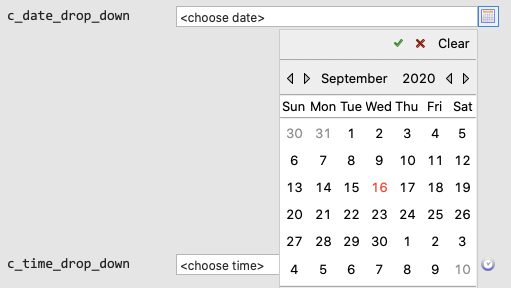
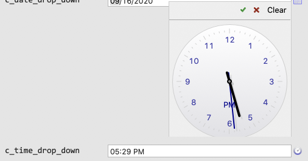
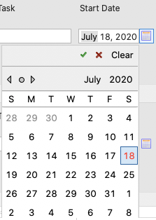

# Nebula CDateTime Widget 1.4.0.2.0
## [ Glimmer Custom Widget](https://github.com/AndyObtiva/glimmer#custom-widget-gem)
[](http://badge.fury.io/rb/glimmer-cw-cdatetime-nebula)

[](https://www.eclipse.org/nebula/widgets/cdatetime/cdatetime.php)

The [Nebula CDateTime Widget](https://www.eclipse.org/nebula/widgets/cdatetime/cdatetime.php) is a Date and Time selection widget that can be used in a plain (graphical), dropdown, spinner, or compact text style.

Packaged as a [Glimmer Custom Widget](https://github.com/AndyObtiva/glimmer#custom-widget-gem) to provide date/time selection via a combo/dropdown-style widget in [Glimmer](https://github.com/AndyObtiva/glimmer) using the `c_date_time` [Glimmer DSL](https://github.com/AndyObtiva/glimmer#glimmer-dsl-syntax) keyword.

[glimmer-cw-cdatetime-nebula](https://rubygems.org/gems/glimmer-cw-cdatetime-nebula) 1.4.0.x.y gem versions map to Nebula CDateTime Widget version 1.4.0

## Table of contents

- [Nebula CDateTime Widget 1.4.0.2.0](#nebula-cdatetime-widget-14020)
  - [Pre-requisites](#pre-requisites)
  - [Setup](#setup)
    - [Glimmer Application](#glimmer-application)
    - [Glimmer Custom Shell or Glimmer Custom Widget](#glimmer-custom-shell-or-glimmer-custom-widget)
    - [Java Imports](#java-imports)
  - [Instructions](#instructions)
    - [Sample](#sample)
    - [Plain](#plain)
      - [`c_date_time`](#cdatetime)
      - [`c_date`](#cdate)
      - [`c_time`](#ctime)
    - [Drop Down](#drop-down)
      - [`c_date_time_drop_down`](#cdatetimedropdown)
      - [`c_date_drop_down`](#cdatedropdown)
      - [`c_time_drop_down`](#ctimedropdown)
    - [Spinner](#spinner)
      - [`c_date_time_spinner`](#cdatetimespinner)
      - [`c_date_spinner`](#cdatespinner)
      - [`c_time_spinner`](#ctimespinner)
    - [Compact](#compact)
      - [`c_date_time_compact`](#cdatetimecompact)
      - [`c_date_compact`](#cdatecompact)
      - [`c_time_compact`](#ctimecompact)
    - [Style](#style)
      - [`cdt`](#cdt)
    - [Data-Binding and Observers:](#data-binding-and-observers)
    - [Table Editing](#table-editing)
  - [API](#api)
    - [Glimmer Custom API](#glimmer-custom-api)
      - [`toggle_open`](#toggleopen)
      - [`text_widget_proxy`](#textwidgetproxy)
  - [TODO](#todo)
  - [Change Log](#change-log)
  - [Contributing to glimmer-cw-cdatetime-nebula](#contributing-to-glimmer-cw-cdatetime-nebula)
  - [Copyright](#copyright)

## Pre-requisites

- [Glimmer](https://github.com/AndyObtiva/glimmer) application, [Glimmer](https://github.com/AndyObtiva/glimmer) custom shell, or another [Glimmer](https://github.com/AndyObtiva/glimmer) custom widget
- JRuby version required by Glimmer
- Java version required by Glimmer

## Setup

Versions follow this convention:
- First 3 digits map to the official Nebula CDateTime library version (e.g. 1.4.0)
- Last 2 digits map to minor and patch versions for Glimmer Custom Widget wrapper

### Glimmer Application

Add the following to a [Glimmer](https://github.com/AndyObtiva/glimmer) application `Gemfile`:

```ruby
gem 'glimmer-cw-cdatetime-nebula', '1.4.0.2.0'
```

Run:

```
jruby -S bundle
```

(or just `bundle` if using [RVM)

### Glimmer Custom Shell or Glimmer Custom Widget

When reusing in a [Glimmer](https://github.com/AndyObtiva/glimmer) custom shell or custom widget, you can follow the same steps for Glimmer application, and then add a require statement to your library file after `glimmer-dsl-swt` and before additional library require statements:

```ruby
require 'glimmer-dsl-swt'
require 'glimmer-cw-cdatetime-nebula'
# ... more require statements follow
```

### Java Imports

Requiring the gem automatically configures java imports in [Glimmer](https://github.com/AndyObtiva/glimmer) for auto import via [JRuby](https://www.jruby.org/) `include_package` on first use:
- `org.eclipse.nebula.cwt`
- `org.eclipse.nebula.widgets.cdatetime`

## Usage Instructions

This [glimmer-cw-cdatetime-nebula](https://rubygems.org/gems/glimmer-cw-cdatetime-nebula) gem adds the `c_date_time` keyword to the [Glimmer GUI DSL](https://github.com/AndyObtiva/glimmer#glimmer-dsl-syntax) as well as other alias keywords as explained below.

The `c_date_time` keyword takes [`CDT`](#cdt) style bits as arguments.

Example:

```ruby
c_date_time(:border, :compact, :drop_down, :date_long)
```

Further instructions may be found at the [Nebula CDateTime Widget homepage](https://www.eclipse.org/nebula/widgets/cdatetime/cdatetime.php).

### Sample

Please run the following command to launch the [Nebula CDateTime Glimmer Custom Widget Gallery](samples/nebula/c_date_time_gallery.rb) app:

```
glimmer sample:run[c_date_time_gallery]
```

### Plain


#### `c_date_time`

Main keyword representing the Nebula CDateTime custom widget. Defaults to date/time pattern `'MM/dd/yyyy hh:mm a'` and plain style with a border

#### `c_date`

Alias keyword that specifies date pattern `'MM/dd/yyyy'` and plain style with a border

#### `c_time`

Alias keyword that specifies time pattern `'hh:mm a'` and plain style with a border

### Drop Down


#### `c_date_time_drop_down`

Alias keyword that specifies date/time pattern `'MM/dd/yyyy hh:mm a'` and drop down style with a border


#### `c_date_drop_down`

Alias keyword that specifies date pattern `'MM/dd/yyyy'` and drop down style with a border



#### `c_time_drop_down`

Alias that specifies time pattern `'hh:mm a'` and drop down style with a border



### Spinner


#### `c_date_time_spinner`

Alias that specifies date/time pattern `'MM/dd/yyyy hh:mm a'` and spinner style with a border

#### `c_date_spinner`

Alias that specifies date pattern `'MM/dd/yyyy'` and spinner style with a border

#### `c_time_spinner`

Alias that specifies time pattern `'hh:mm a'` and spinner style with a border

### Compact


#### `c_date_time_compact`

Alias that specifies date/time pattern `'MM/dd/yyyy hh:mm a'` and compact style (just a text field) with a border

#### `c_date_compact`

Alias that specifies date pattern `'MM/dd/yyyy'` and compact style (just a text field) with a border

#### `c_time_compact`

Alias that specifies time pattern `'hh:mm a'` and compact style (just a text field) with a border

### Style

#### `cdt`

[`CDT`](https://www.eclipse.org/nebula/releases/latest/javadoc/org/eclipse/nebula/widgets/cdatetime/CDT.html) styles are fully documented in the [Nebula `CDT` Javadoc](https://www.eclipse.org/nebula/releases/latest/javadoc/org/eclipse/nebula/widgets/cdatetime/CDT.html).

The `cdt` keyword builds a [`CDT`](https://www.eclipse.org/nebula/releases/latest/javadoc/org/eclipse/nebula/widgets/cdatetime/CDT.html) style by passing in comma-separated symbols (e.g. `cdt(:border, :drop_down, :date_long)`)

For example, instead of passing style as bit-or'ed `CDT` Constant style bits:

```ruby
c_date_time(CDT::BORDER | CDT::COMPACT | CDT::DROP_DOWN | CDT::DATE_LONG)
```

You instead pass style as comma-separated symbols:

```ruby
c_date_time(cdt(:border, :compact, :drop_down, :date_long))
```

However, `c_date_time` goes one step further and uses it internally automatically by all `c_date_time` keyword initializers, so you could ditch the `cdt` entirely when constructing a widget.

```ruby
c_date_time(:border, :compact, :drop_down, :date_long)
```

Furthermore, `c_date_time` has pre-configured smart defaults for `CDT` styles:

```
'c_date_time'              => [:border, :tab_fields, :simple],
'c_date'                   => [:border, :tab_fields, :date_short, :simple],
'c_time'                   => [:border, :tab_fields, :time_short, :simple],
'c_date_time_compact'      => [:border, :tab_fields, :compact],
'c_date_compact'           => [:border, :tab_fields, :date_short, :compact],
'c_time_compact'           => [:border, :tab_fields, :time_short, :compact],
'c_date_time_spinner'      => [:border, :tab_fields, :spinner],
'c_date_spinner'           => [:border, :tab_fields, :date_short, :spinner],
'c_time_spinner'           => [:border, :tab_fields, :time_short, :spinner],
'c_date_time_drop_down'    => [:border, :tab_fields, :drop_down],
'c_date_drop_down'         => [:border, :tab_fields, :drop_down, :date_short],
'c_time_drop_down'         => [:border, :tab_fields, :drop_down, :time_short],
```

### Data-Binding and Observers:

The `selection` property provides access to the value selected by the user. It can be hooked with basic data-binding to a model property. Additionaly observers may be attached too, such as `on_widget_selected` and `on_key_pressed`.

Example:

```ruby
# ... 
  composite {
    # ...
    @start_at = c_date_time(:border, :drop_down, :date_long) {
      # ...
      selection bind(@task, :start_at)
      on_key_pressed { |event|
        @end_at.swt_widget.set_focus if event.keyCode == swt(:cr)
      }
    }
  }
# ...
```



### Table Editing

`c_date_time` can be used as a `table` / `table_column` editor.

Example:

```ruby
# ...
  table { |table_proxy|
    # ... other table_column declarations
    table_column {
      text 'Start Date'
      width CONFIG[:table_column_width_hint]
      editor :c_date_time, cdt(:border, :drop_down, :date_long), property: :start_at
    }
    table_column {
      text 'End Date'
      width CONFIG[:table_column_width_hint]
      editor :c_date_time, cdt(:border, :drop_down, :date_long), property: :end_at
    }
    # ... other table_column declarations
    items bind(Task, :list), column_properties(:project_name, :task_type, :name, :start_date, :end_date, :duration, :priority)
    # ... other table GUI code
  }
# ...
```


## API

You may check out the Nebula CDateTime Widget [Javadoc API](https://www.eclipse.org/nebula/releases/latest/javadoc/org/eclipse/nebula/widgets/cdatetime/CDateTime.html).

### Glimmer Custom API

Glimmer adds a few extra API methods to CDateTime from Nebula.

#### `toggle_open`

Programmatically toggle date/time dropdown as open (simpler than directly calling `.swt_widget.set_open` in certain circumstances)

#### `text_widget_proxy`

Provides access to the inner text widget to allow programmatic adding of obesrvers and/or data-binding.

Example:

```
c_time { |proxy|
  proxy.text_widget_proxy.content {
    on_swt_mouseup { |event|
    	 proxy.toggle_open
    }
  }
}
```


## TODO

[TODO.md](TODO.md)

## Change Log

[CHANGELOG.md](CHANGELOG.md)

## Contributing to glimmer-cw-cdatetime-nebula
 
- Check out the latest master to make sure the feature hasn't been implemented or the bug hasn't been fixed yet.
- Check out the issue tracker to make sure someone already hasn't requested it and/or contributed it.
- Fork the project.
- Start a feature/bugfix branch.
- Commit and push until you are happy with your contribution.
- Make sure to add tests for it. This is important so I don't break it in a future version unintentionally.
- Please try not to mess with the Rakefile, version, or history. If you want to have your own version, or is otherwise necessary, that is fine, but please isolate to its own commit so I can cherry-pick around it.

## Copyright

[MIT](LICENSE.txt)

Copyright (c) 2020 - Andy Maleh

--

[](https://github.com/AndyObtiva/glimmer) Built for [Glimmer](https://github.com/AndyObtiva/glimmer) (Ruby Desktop Development GUI Library).
